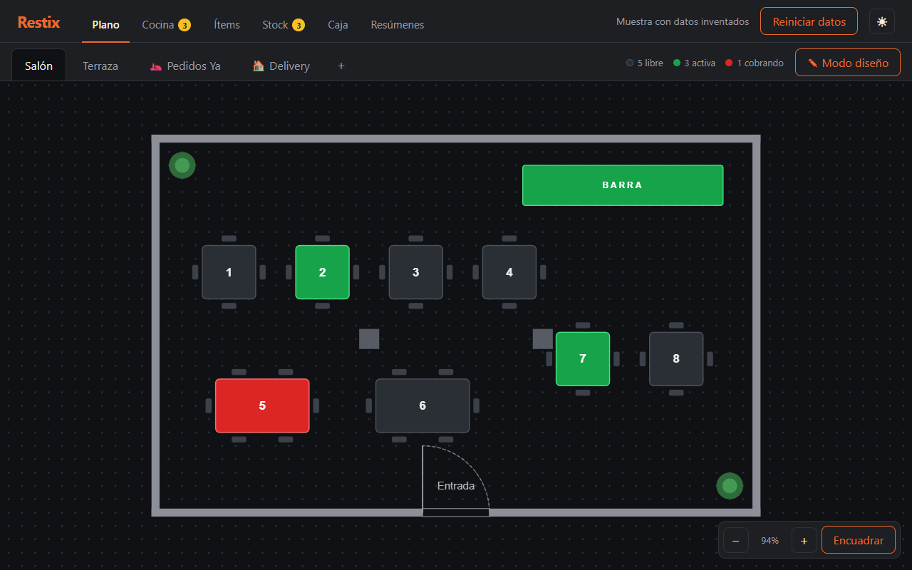
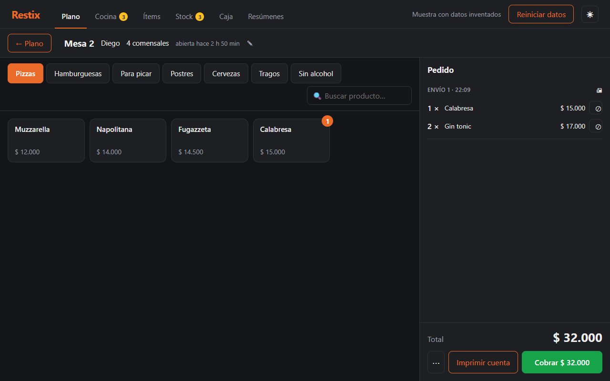
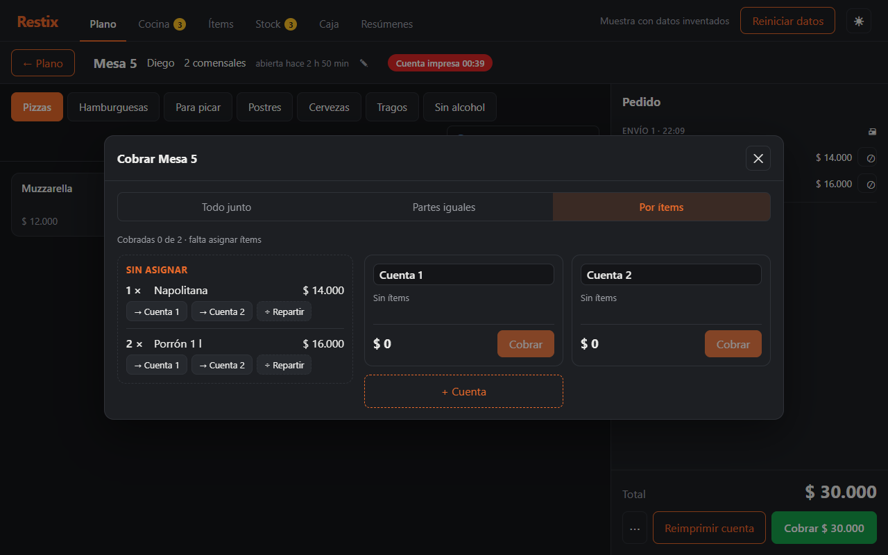
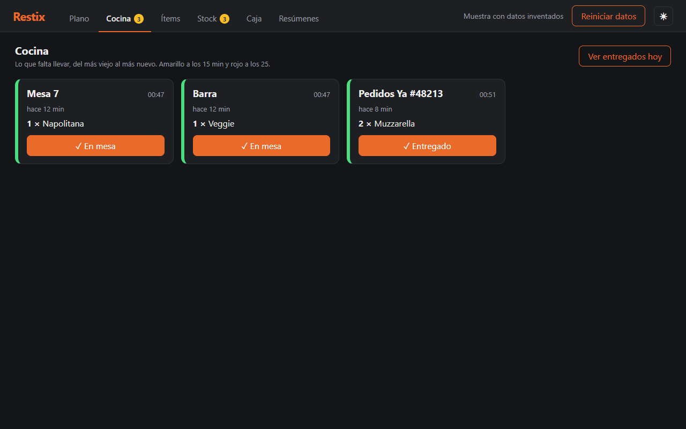
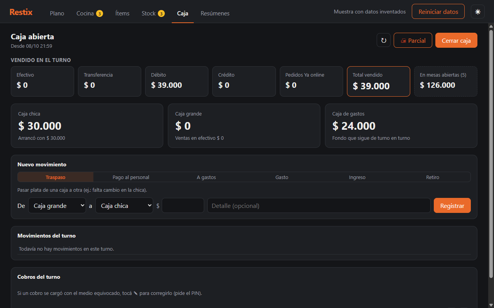
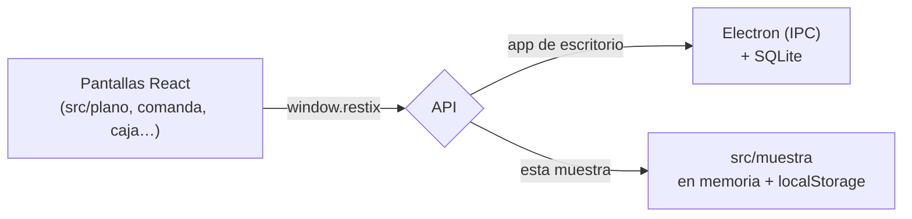

# Restix · muestra web

[](https://github.com/sarlenguito-commits/restix-muestra/actions/workflows/publicar.yml)

👉 **Probala:** https://sarlenguito-commits.github.io/restix-muestra/ (datos inventados, no hace falta cuenta)

**Restix** es un sistema de gestión para **bares y restaurantes** que desarrollo como producto comercial: un programa
de escritorio para Windows (Electron + React + TypeScript + SQLite) con mesas, comandas a cocina y barra, cobro con
varios medios de pago, división de cuentas, caja con arqueo, stock con recetas y resúmenes.

Este repositorio es una **muestra pública**: las mismas pantallas de React, pero corriendo en el navegador con un
backend simulado y un bar inventado ("Bar El Patio"). Todo lo que hagas queda guardado solo en tu navegador, y
"Reiniciar datos" vuelve al principio.

`React 19` `TypeScript` `Vite` `Konva` `Vitest` `GitHub Actions`



## Qué se puede probar

1. **Plano:** el salón con las mesas libres (gris), con gente (verde) y que pidieron la cuenta (rojo). Hay pestañas
   para la terraza, Pedidos Ya y Delivery. Con **Modo diseño** se arman las mesas arrastrando, girando y cambiando
   el tamaño.
2. **Tomar un pedido:** tocá una mesa libre, elegí el mozo y cargá productos. **Enviar** lo manda a cocina y barra
   (con su ticket) y descuenta el stock según la receta de cada producto.
3. **Cocina:** lo que falta salir, del más viejo al más nuevo, con colores a los 15 y 25 minutos.
4. **Cobrar:** todo junto, en partes iguales o **por ítems** (cada uno paga lo suyo, y lo compartido se reparte:
   ½ pizza para cada uno). Descuentos, varios medios de pago en un mismo cobro y vuelto en efectivo.
5. **Caja:** tres cajas (chica, grande y gastos), pagos al personal, corrección de un cobro mal cargado y cierre con
   arqueo: cuánto tendría que haber y cuánto se contó. El PIN de administrador de la muestra es **1234**.
6. **Resúmenes:** una semana de turnos ya trabajados, el arqueo de cada día y el ranking de productos del mes.

| Comanda | Cobro por ítems |
|---|---|
|  |  |
| **Cocina** | **Caja** |
|  |  |

## Cómo está hecho

Las pantallas no saben si están en la app de escritorio o en la muestra: le piden todo a una sola API,
`window.restix`. En Restix esa API la pone Electron y viaja por IPC hasta la base SQLite; acá la pone
[`src/muestra/api.ts`](src/muestra/api.ts) y responde un backend escrito para la muestra, que guarda en `localStorage`.



Algunas decisiones que se ven en el código:

- **Plata en centavos y enteros** (`$ 9.000` = `900000`): nada de decimales flotantes en los importes.
- **Repartir sin perder un centavo:** si tres personas comparten una pizza de $ 10.000, las partes son 3.333,
  3.333 y 3.334 (la última cuenta absorbe el redondeo). Lo prueba `muestra.test.ts`.
- **Los saldos de caja no se guardan, se calculan** con los movimientos: así nunca se descuadran.
- **Topes contra valores absurdos** en todo lo que se carga (precios, cantidades, montos, stock), para frenar errores
  de tipeo.
- **Todo o nada:** cada operación valida todo antes de tocar los datos (por ejemplo, una receta con un renglón
  inválido no guarda ninguno).
- **Datos de muestra armados con la propia app:** la semana de turnos de [`semilla.ts`](src/muestra/semilla.ts) se
  genera abriendo mesas, enviando y cobrando con las mismas funciones que usan las pantallas, moviendo el reloj hacia
  atrás. Así los números de Caja y Resúmenes cierran igual que en el uso real.

### Qué se dejó afuera a propósito

Lo que hace a Restix un producto y no tiene sentido en una muestra: licencias y activación, factura electrónica
(ARCA), impresión en impresoras térmicas (acá los tickets se ven en pantalla), copias de seguridad, actualizaciones y
los ajustes del local.

## Correrla en tu compu

Con Node 20 o más nuevo:

```bash
npm install
npm run dev        # http://localhost:5173
npm test           # pruebas del backend de la muestra (Vitest)
npm run build      # revisa los tipos y arma el sitio en dist/
```

`node herramientas/capturas.mjs` vuelve a sacar las capturas de este README (usa Chrome sin ventana).

Cada cambio que llega a `main` pasa por GitHub Actions: revisión de tipos, pruebas, build y publicación en
GitHub Pages ([`.github/workflows/publicar.yml`](.github/workflows/publicar.yml)).

## Carpetas

```
src/
├── plano/ comanda/ cocina/ items/ stock/ caja/ components/   ← pantallas (las mismas de Restix)
├── shared/            ← tipos y armado de tickets (compartidos con el backend)
└── muestra/           ← el backend de la muestra: datos, reglas, semilla y pruebas
herramientas/          ← script de capturas
docs/capturas/         ← imágenes de este README
```

---

Hecho por [Esteban Sarlengo](https://github.com/sarlenguito-commits) · Neuquén, Argentina.
El código se publica para mostrar cómo trabajo: Restix es un producto comercial y este repositorio no tiene licencia
de uso libre.
